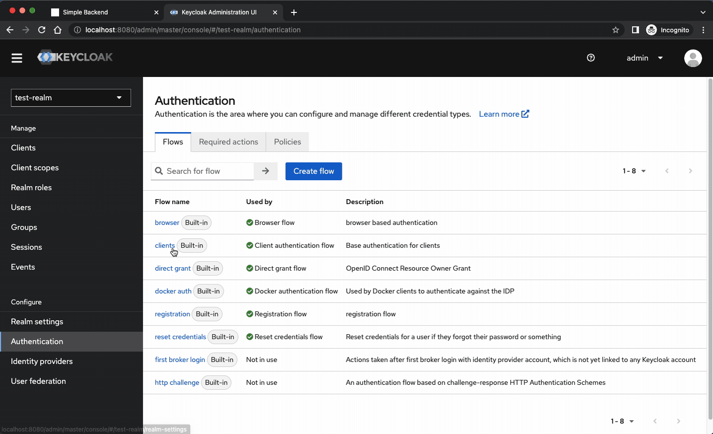

# Keycloak Custom Extension for Client Authentication

This Maven project implements a custom extension for Keycloak, enabling client authentication using a client ID and secret.

## Prerequisites

- Java Development Kit (JDK) 11 or higher
- Apache Maven
- optionally, an IDE like Eclipse, NetBeans etc.

## Installation

1. Clone this repository to your local machine.
2. Navigate to the project directory.
3. Build the project using Maven: `mvn clean package`
4. Deploy the built JAR artifact to your Keycloak server by copying it to the `/opt/keycloak/providers` directory.
5. Run Keycloak with `kc.sh build` to integrate your extension first.
6. Then run it with `kc.sh start-dev`

## Creating the Custom Authentication Flow

1. Click on "Authentication" tab.
2. Select `clients` flow.
3. In the "Action" menu, select "Duplicate" to create a new flow called "Custom Clients".
4. Click the button "Add Step" and choose "Simple Client Authenticator" execution from the modal window.
5. Move "Simple Client Authenticator" to the top of the flow list.
6. Set the "Simple Client Authenticator" execution to "Alternative".
7. In the `Action` menu, select "Bind flow".
8. Select "Client Authentication" from the dropdown menu and click "Save".

## Usage

With the custom extension deployed and configured, client authentication using a client ID and secret will be enabled for the selected authentication flow in Keycloak.

When using the custom client authentication, make sure to follow these steps:

1. Ensure the client that requires authentication is configured in Keycloak with the correct client ID and secret.
2. In the "Credentials" tab of the client configuration, set the appropriate password.
3. From your backend application, provide the client ID and secret during the authentication process.

## Additional Information

For more details on Keycloak custom extensions and configuration, refer to the Keycloak documentation.

Please note that this custom extension is provided as a sample implementation and may require further customization to suit your specific requirements.
